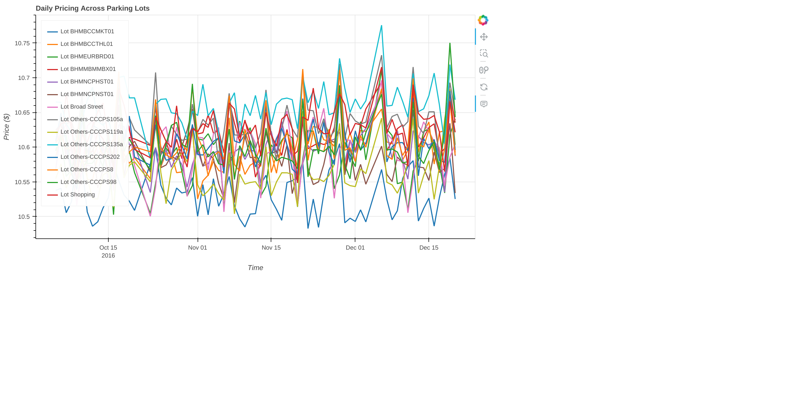

# Dynamic Parking Pricing using Real-Time Streaming

This project implements **dynamic parking pricing models** using **real-time streaming data**, processed via [Pathway](https://pathway.com) and visualized with [Bokeh](https://bokeh.org). The objective is to optimize parking lot pricing dynamically based on demand signals such as occupancy volatility, queue length, traffic conditions, and more.

---

## Models Implemented

| Model | Name                     | Description                                                                                    |
| ----- | ------------------------ | ---------------------------------------------------------------------------------------------- |
| 1     | Linear Pricing           | Adjusts price based on daily fluctuations in occupancy rate.                                   |
| 2     | Demand-Based Pricing     | Prices based on weighted demand factors such as queue, traffic, special day, and vehicle type. |

---

## Tech Stack

| Category         | Tools/Libraries                           |
| ---------------- | ----------------------------------------- |
| Real-Time Engine | `pathway`                                 |
| Data Handling    | `pandas`, `numpy`                         |
| Visualization    | `bokeh`, `panel`, `seaborn`, `matplotlib` |
| Environment      | Google Colab / Jupyter                    |
| Output Formats   | `CSV`, `JSONL`, `HTML`                    |

---

## Architecture Diagram


--This flowchart outlines the end-to-end pipeline for the Dynamic Parking Pricing system, detailing both Model 1 (Linear Pricing) and Model 2 (Demand-Based Pricing):

--**Overall Workflow**:
---**Raw Data Input**
----Starts with a CSV dataset containing fields like timestamp, occupancy, capacity, queue length, traffic condition, vehicle type, and special day indicators.
---**Preprocessing**
----Combines date and time fields into a proper timestamp.
----Computes occupancy rate as occupancy / capacity.
---**Real-time Stream Ingestion**
----The processed CSV is fed into the system using Pathway's CSV replay to simulate a real-time data stream.

---

## Data Flow Summary

### Model 1: Linear Pricing

**Formula:**
```python
price = 10 + (max_occupancy_rate - min_occupancy_rate) / capacity
```

**Workflow:**
```
CSV ➝ Timestamp Merge ➝ OccupancyRate ➝ Pathway Tumbling Window ➝
Compute Max/Min ➝ Apply Price Formula ➝ JSONL Output ➝ Bokeh/Panel
```

**Model 1 Visuals:**


---

### Model 2: Demand-Based Pricing

**Demand Formula:**
```python
demand = 1*occ + 0.5*queue - 0.2*traffic + 2*special + 0.8*vehicle
```

**Price Formula:**
```python
price = base * (1 + lambda * min(demand / max_demand, 1))
```

**Workflow:**
```
CSV ➝ Timestamp Merge ➝ Feature Encoding ➝ Pathway Tumbling Window ➝
Aggregate Demand Components ➝ Compute Demand ➝ Normalize ➝
Compute Price ➝ JSONL Output ➝ Bokeh/Panel
```

**Model 2 Visual:**




---

## Interactive HTML Outputs

| File                                  | Description                          |
| ------------------------------------- | ------------------------------------ |
| `outputs/model1_price_trends.html`    | Lot-wise trends from Model 1         |
| `outputs/model2_price_trends.html`    | Lot-wise trends from Model 2         |
| `outputs/model2_combined_price_comparison.html` | Combined trends across lots (Model 2) |

---

## CSV Pricing Outputs (converted from jsonl --> csv)

| File                  | Description                      |
|-----------------------|----------------------------------|
| `outputs/pricing_output_model1.csv`  | Final price output from Model 1 (Linear-Based)   |
| `outputs/pricing_output_model2.csv`  | Final price output from Model 2 (Demand-Based)   |

---

## Notebooks Included

- `notebooks/model1_linear_pricing.ipynb`
- `notebooks/model2_demand_pricing.ipynb`

---


## Project Status

- [x] Real-time stream simulation with Pathway
- [x] Model 1: Volatility-based pricing
- [x] Model 2: Demand-based pricing
- [x] Bokeh-based dashboard visualization
- [x] HTML/JSONL output export

---

## Future Improvements

-  **API Integration** – Stream real-time data via WebSocket or REST.
-  **Smarter Geospatial Logic** – Use GPS and road network data.
-  **Advanced Pricing Models** – Add ML/RL-based dynamic pricing.
-  **Better Visualizations** – Interactive dashboards with filters and heatmaps.
-  **Historical Logging** – Store pricing data for analysis.
-  **A/B Testing** – Compare model performance across lots.
-  **Modular Codebase** – Refactor into reusable components with config support.
-  **Docker Support** – Easy deployment via Docker and Compose.
-  **Testing & CI** – Add unit tests and GitHub Actions.
-  **Security Enhancements** – Role-based access and secure endpoints.

---
